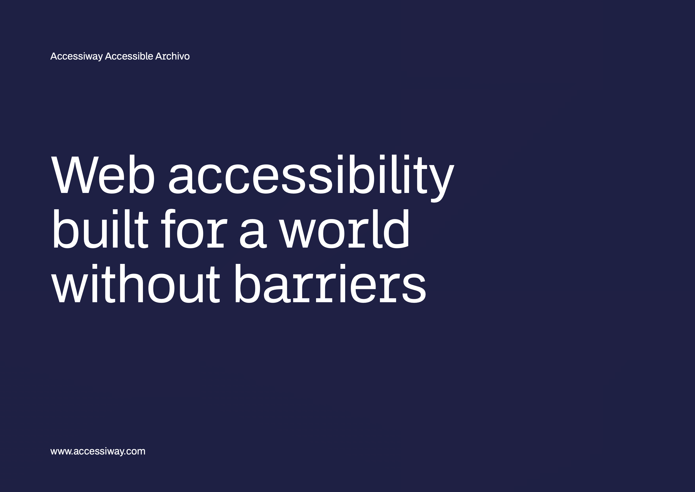
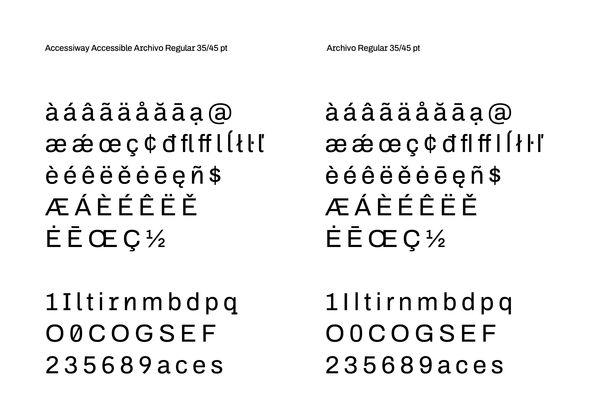

# AAA (Accessiway Accessible Archivo) Family

**Omnibus-Type** | **SIL Open Font License 1.1**

AAA (Accessiway Accessible Archivo) family is a typeface derivation developed in strategic collaboration with Accessiway, designed to mitigate reading barriers and optimize the digital experience for users with cognitive disabilities and dyslexia.

We surgically modified the skeletons of critical glyphs (such as I/l/1, b/d/p/q, O/0, 6/8/9, E/F) to ensure clear differentiation and reduce visual ambiguity. Furthermore, we optimized spacing and screen rendering to improve reading rhythm and prevent visual crowding of characters.

These enhancements were empirically validated through legibility testing with users diagnosed with dyslexia, confirming a significant reduction in reading errors and visual strain. The typeface family includes four weights optimized for accessibility and is released under the SIL Open Font License (OFL) to democratize access to inclusive design.

## AAA Archivo Family Contains:

- Regular
- Italic
- Bold
- Bold Italic

## Language Support

AAA Archivo supports the following Unicode language ranges:

- Basic Latin 			U+0020-U+007E
- Latin-1 Supplement 		U+00A0-U+00FF
- Latin Extended-A 		U+0100-U+017F
- Latin Extended Additional	U+1E00-U+1EFF (partial)

**Character map to support MS Codepages:**
- 1252 Latin-1
- 1250 Latin-2 (Eastern Europe)
- 1254 Turkish
- 1257 Windows Baltic
- 1258 Vietnamese
- Mac Roman

## Accessibility Features

This typeface has been specifically designed to address common reading challenges:

- **Differentiated Glyphs**: Critical character pairs (1/I/l, b/d/p/q, O/0) have been structurally modified to eliminate visual confusion
- **Optimized Spacing**: Enhanced kerning and tracking to prevent visual crowding
- **Screen Optimization**: Designed for superior rendering in digital environments
- **Validated Design**: Tested with dyslexic users to ensure real-world effectiveness

## Contributing

To contribute to the project, contact [Omnibus-Type](http://omnibus-type.com/) or email omnibus.type@gmail.com

## Designers

- **Héctor Gatti** - Original Archivo Designer
- **Pablo Cosgaya** - Accessiway Accessible Archivo Modifications
- **Aldo De Losa** - Accessiway Accessible Archivo Modifications

## License

Copyright 2026 Omnibus-Type (www.omnibus-type.com | omnibus.type@gmail.com)

Licensed under the [SIL Open Font License, 1.1](http://scripts.sil.org/OFL); you may not use this file except in compliance with the License.

---

## FONTLOG for the AAA Archivo fonts

This file provides detailed information on the AAA Archivo font software. This information should be distributed along with the AAA Archivo fonts and any derivative works.

### Accessiway Accessible Archivo - Version 1.0 (2026)

**2026 July - August (v1.000)**
- Initial release of Accessiway Accessible Archivo
- Surgical modification of critical glyph skeletons (I/l/1, b/d/p/q, O/0, 6/8/9, E/F, r/n/m)
- Optimized spacing and kerning for accessibility
- Screen rendering optimization for all four weights
- Empirical validation through dyslexia legibility testing
- Extended Latin character support (ñ, è, à, and other diacritics)
- Released under SIL Open Font License

**Development Process:**
- March 2026: Project initiation with Accessiway team (led by Jacopo Deyla)
- April-May 2026: Structural modifications and iterative design reviews with Accessiway (Margherita Zago, Diana Dee Rabba)
- June 2026: Legibility testing with dyslexic users
- July 2026: Final adjustments and preparation for Google Fonts onboarding

---

### Archivo Family - Historical Versions

**2020 Dec 14 (v2.000)**
- Added new weights
- Added ExtraCondensed and Expanded widths
- Mastering for Variable fonts

**2018 Aug 12 (v1.003)**
- Updated to GF Latin Plus set
- Supports 219 Latin languages used in 212 countries

**2017 May 21 (v1.002)**
- Added alternative ampersand

**2016 July 10 (v1.001)**
- Made master compatibles
- New weights by interpolation (Medium and Semibold)

**2016 June 4 (v1.000)**
- Initial Commit

---

## Acknowledgements

If you make modifications, be sure to add your name (N), email (E), web-address (if you have one) (W), and description (D). This list is in alphabetical order.

**N:** Héctor Gatti  
**E:** omnibus.type@gmail.com  
**W:** http://www.omnibus-type.com  
**D:** Original Archivo Designer

**N:** Pablo Cosgaya  
**E:** omnibus.type@gmail.com  
**W:** http://www.omnibus-type.com  
**D:** Accessiway Accessible Archivo Modifications

**Special Thanks:**
- Accessiway Team (Jacopo Deyla, Margherita Zago, Diana Dee Rabba) for collaboration and user testing
- Emma Marichal, Dave Crossland and the Google Fonts team for onboarding support
- All users who participated in legibility testing

---

For more information about Omnibus-Type custom projects, visit [www.omnibus-type.com](http://www.omnibus-type.com/)
