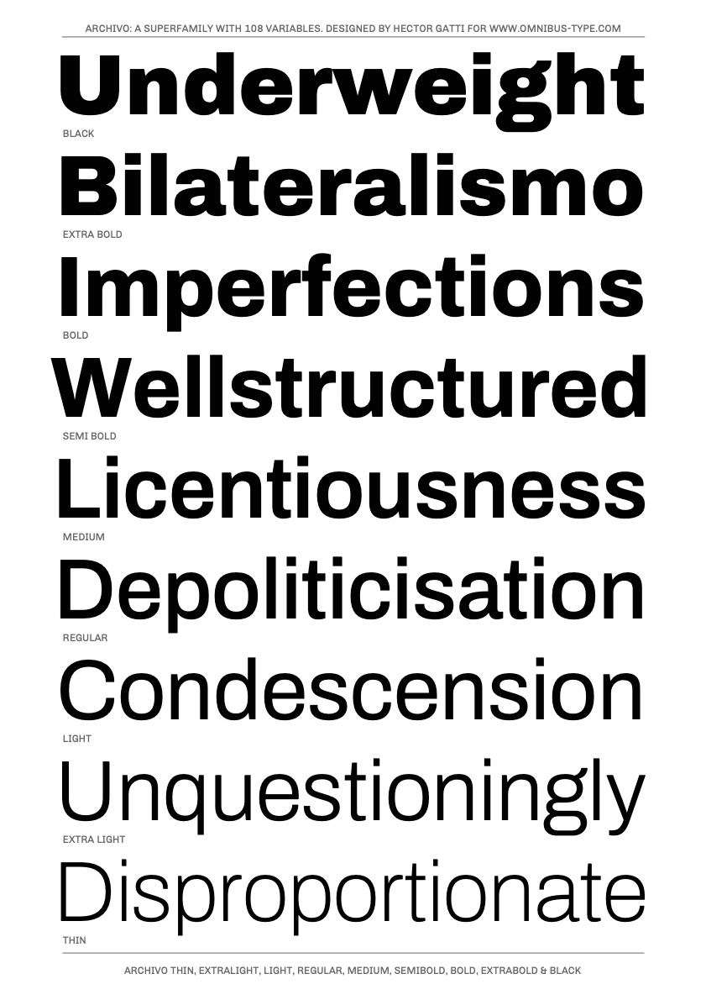
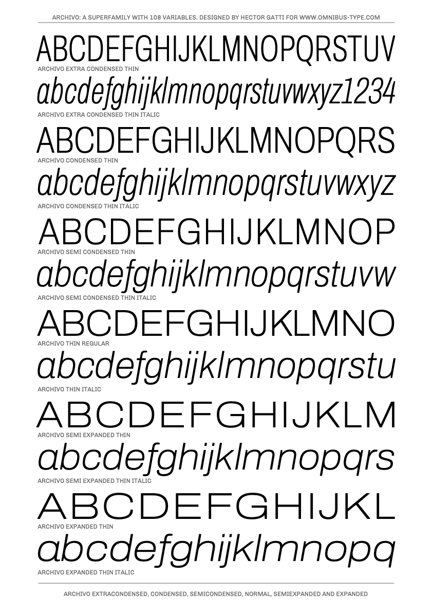
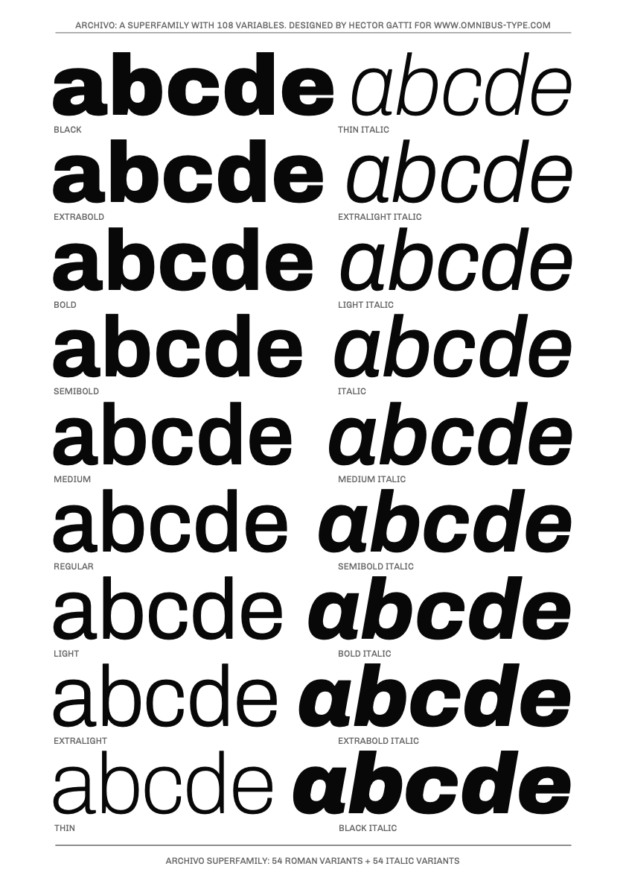

# Archivo family

**Omnibus-Type**  
*SIL Open Font License, 1.1*

Archivo is a grotesque font reminiscent of late nineteenth century. It was designed to be used simultaneously in print and online platforms and supports over 200 world languages.

####Archivo family contains:

* Extracondensed Thin/Extracondensed Thin Italic
* Extracondensed ExtraLight/Extracondensed Extralight Italic
* Extracondensed Light/Extracondensed Light Italic
* Extracondensed Regular/Extracondensed Italic
* Extracondensed Medium/Extracondensed Medium Italic
* Extracondensed SemiBold/Extracondensed SemiBold Italic
* Extracondensed Bold/Extracondensed Bold Italic
* Extracondensed ExtraBold/Extracondensed ExtraBold Italic
* Extracondensed Black/Extracondensed Black Italic

* Condensed Thin/Condensed Thin Italic
* Condensed ExtraLight/Condensed Extralight Italic
* Condensed Light/Condensed Light Italic
* Condensed Regular/Condensed Italic
* Condensed Medium/Condensed Medium Italic
* Condensed SemiBold/Condensed SemiBold Italic
* Condensed Bold/Condensed Bold Italic
* Condensed ExtraBold/Condensed ExtraBold Italic
* Condensed Black/Condensed Black Italic

* SemiCondensed Thin/SemiCondensed Thin Italic
* SemiCondensed ExtraLight/SemiCondensed Extralight Italic
* SemiCondensed Light/SemiCondensed Light Italic
* SemiCondensed Regular/SemiCondensed Italic
* SemiCondensed Medium/SemiCondensed Medium Italic
* SemiCondensed SemiBold/SemiCondensed SemiBold Italic
* SemiCondensed Bold/SemiCondensed Bold Italic
* SemiCondensed ExtraBold/SemiCondensed ExtraBold Italic
* SemiCondensed Black/SemiCondensed Black Italic

* Thin/Thin Italic
* ExtraLight/Extralight Italic
* Light/Light Italic
* Regular/Italic
* Medium/Medium Italic
* SemiBold/SemiBold Italic
* Bold/Bold Italic
* ExtraBold/ExtraBold Italic
* Black/Black Italic

* SemiExpanded Thin/SemiExpanded Thin Italic
* SemiExpanded ExtraLight/SemiExpanded Extralight Italic
* SemiExpanded Light/SemiExpanded Light Italic
* SemiExpanded Regular/SemiExpanded Italic
* SemiExpanded Medium/SemiExpanded Medium Italic
* SemiExpanded SemiBold/SemiExpanded SemiBold Italic
* SemiExpanded Bold/SemiExpanded Bold Italic
* SemiExpanded ExtraBold/SemiExpanded ExtraBold Italic
* SemiExpanded Black/SemiExpanded Black Italic

* Expanded Thin/Expanded Thin Italic
* Expanded ExtraLight/Expanded Extralight Italic
* Expanded Light/Expanded Light Italic
* Expanded Regular/Expanded Italic
* Expanded Medium/Expanded Medium Italic
* Expanded SemiBold/Expanded SemiBold Italic
* Expanded Bold/Expanded Bold Italic
* Expanded ExtraBold/Expanded ExtraBold Italic
* Expanded Black/Expanded Black Italic

To contribute to the project contact [Omnibus-Type](http://omnibus-type.com/).

### Designers

* Héctor Gatti

### License

Copyright 2019 Omnibus-Type (www.omnibus-type.com | omnibus.type@gmail.com)

Licensed under the [*SIL Open Font License, 1.1*](http://scripts.sil.org/OFL); you may not use this file except in compliance with the License.

======
## FONTLOG for the Archivo fonts

This file provides detailed information on the Archivo font software.  
This information should be distributed along with the Archivo fonts and any derivative works.

### Archivo is a typeface family that supports the following Unicode language range: 

* Basic Latin 				U+0020-U+007E
* Latin-1 Supplement 		U+00A0-U+00FF
* Latin Extended-A 			U+0100-U+017F
* Latin Extended Additional*	U+1E00-U+1EFF *(111/256)

**Character map to support MS Codepages:**
* 1252 Latin-1
* 1250 Latin-2 (Easter Europe)
* 1254 Turkish
* 1257 Windows Baltic
* 1258 Vietnamese
* Mac Roman

*To contribute to the project contact Omnibus-Type at omnibus.type@gmail.com*

**2020 Dec 14 (v2.000)
- Added new weights
- Added ExtraCondensed and Expanded widths
- Mastering for Variable fonts

**2018 Aug 12 (v1.003)**
- Updated to GF Latin Plus set
- Supports 219 Latin languages used in 212 countries

**2017 May 21 (v1.002) Alternative ampersand**
- Added alternative ampersand

**2016 July 10 (v1.001) Medium and Semibold**
- Made master compatibles
- New weights by interpolation (Medium and Semibold)

**2016 June 4 (v1.000) Initial Commit**

- Initial Commit

### Acknowledgements

If you make modifications be sure to add your name (N), email (E), web-address
(if you have one) (W) and description (D). This list is in alphabetical order.

**N:** **Héctor Gatti**  
**E:** omnibus.type@gmail.com  
**W:** http://www.omnibus-type.com  
**D:** Designer

**N:** **Yorlmar Campos**  
**E:** omnibus.type@gmail.com 
**W:** http://www.omnibus-type.com  
**D:** Typeface development 